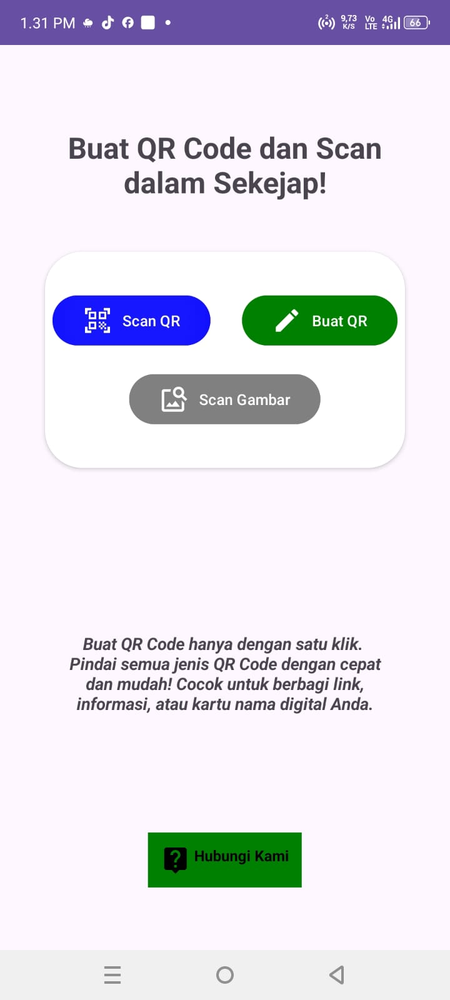
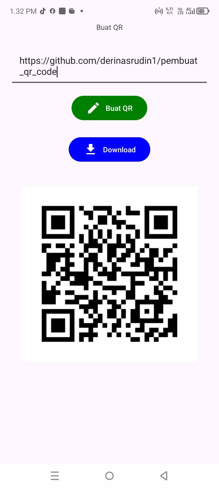
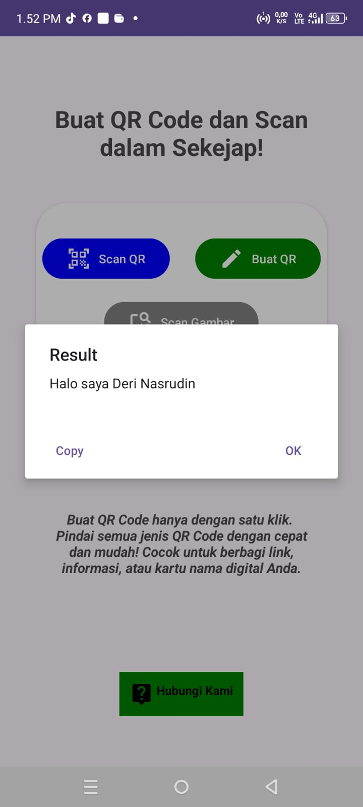
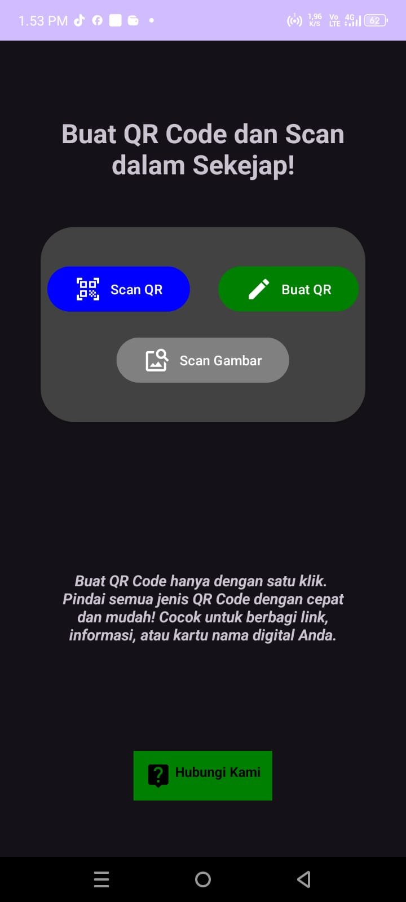
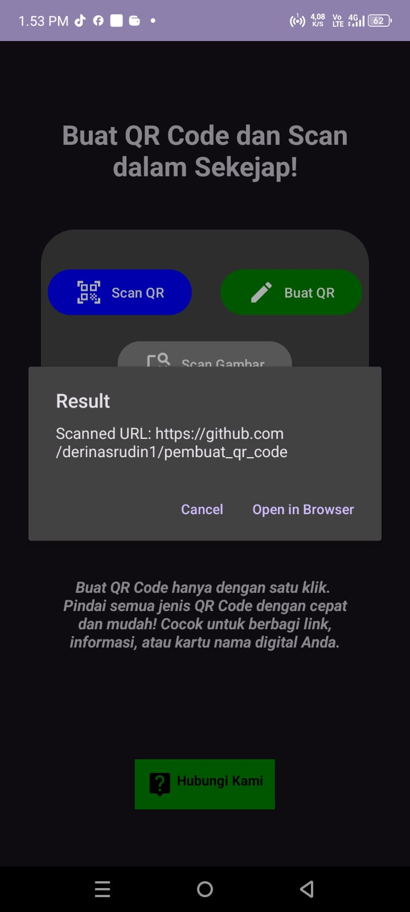

# 📱 Aplikasi Pembuat dan Scan QR Code

Aplikasi **Pembuat dan Scan QR Code** memungkinkan pengguna untuk membuat serta memindai QR Code dengan mudah dan cepat. Cocok digunakan untuk membagikan informasi seperti tautan, teks, atau kontak digital hanya dalam beberapa langkah.

---

## 🚀 **Fitur Utama**

1. **Buat QR Code**

   - Buat QR Code dari teks, tautan, atau informasi lainnya.
   - Tersedia dalam format cepat dan sederhana.

2. **Scan QR Code**

   - Pindai QR Code secara langsung menggunakan kamera perangkat Anda.
   - Hasil pemindaian langsung ditampilkan di layar.

3. **Scan QR Dari Gambar**

   - Pindai QR Code dari file gambar/ dari galeri.

4. **Tampilan Sederhana & Mudah Digunakan**
   - UI ramah pengguna dan responsif.

---

## 📷 **Screenshot**
<div style="display: flex; justify-content: space-around; align-items: center;">





</div>

---

## 🛠️ **Teknologi yang Digunakan**

- **Android Studio** sebagai IDE.
- **Kotlin** atau **Java** sebagai bahasa pemrograman utama.
- **ZXing Library** untuk pemrosesan QR Code.

---

## 📥 **Cara Instalasi**

1. Clone repository ini:
   ```bash
   git clone https://github.com/derinasrudin1/pembuat_qr_code.git
   ```
2. Buka proyek menggunakan Android Studio.
3. Jalankan aplikasi pada emulator atau perangkat fisik.
4. Nikmati fitur buat dan scan QR Code! 🚀

## 🧩 **Dependencies**

Tambahkan dependencies berikut di file build.gradle jika diperlukan:

```bash
dependencies {
    implementation 'com.journeyapps:zxing-android-embedded:4.3.0'
    }
```

## 🏷️ **License**

Proyek ini menggunakan lisensi MIT. Silakan gunakan dan kembangkan kembali sesuai kebutuhan.
